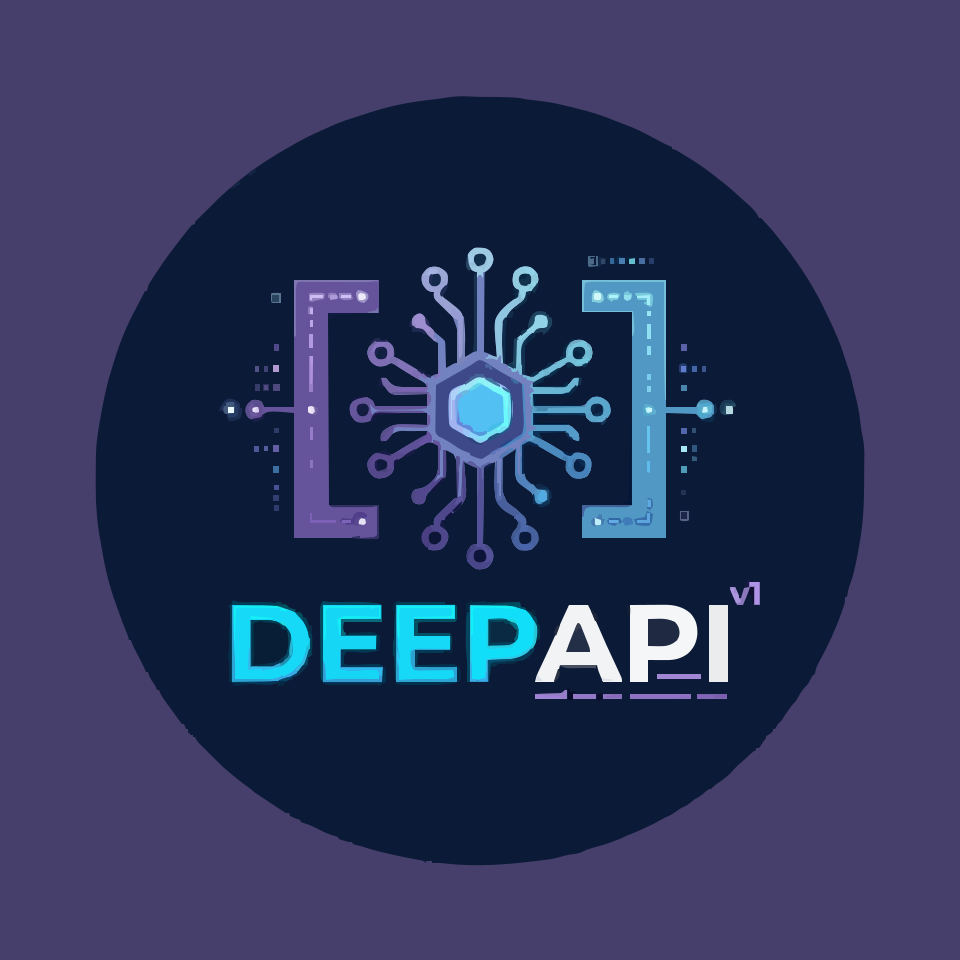

<p align="center">
  
</p>

# DeepAPI - Phiên bản Vibecode

[](LICENSE)


**Ngôn ngữ:** [Tiếng Việt](README.vi.md) | [English](README.en.md) | [中文](README.MD)

Chuyển đổi khả năng chat của DeepSeek Web thành API tương thích với OpenAI, Claude và Gemini. Backend được viết bằng **Go**, frontend là React WebUI để quản lý.

**Phiên bản này bao gồm:**
- ✨ Giao diện Vibecode (Cyberpunk theme)
- 📊 Analytics Dashboard (Thống kê token usage)
- 🔄 Hệ thống tự động cập nhật qua Git
- 🚀 Deploy dễ dàng lên VPS với Cloudflare Tunnel

> **Lưu ý quan trọng**
>
> Dự án này chỉ dành cho mục đích học tập, nghiên cứu và thử nghiệm cá nhân. Không cung cấp bất kỳ bảo đảm nào về tính thương mại, độ ổn định hay kết quả.
>
> Tác giả không chịu trách nhiệm về bất kỳ thiệt hại, mất dữ liệu, rủi ro pháp lý hay khiếu nại từ bên thứ ba phát sinh từ việc sử dụng, chỉnh sửa, phân phối hoặc triển khai dự án này.
>
> Vui lòng không sử dụng dự án này cho các mục đích vi phạm điều khoản dịch vụ, thỏa thuận, luật pháp hoặc quy định của nền tảng.

## Mục lục

- [Tính năng chính](#tính-năng-chính)
- [Kiến trúc hệ thống](#kiến-trúc-hệ-thống)
- [Hỗ trợ API](#hỗ-trợ-api)
- [Triển khai nhanh](#triển-khai-nhanh)
  - [Cách 1: VPS với script tự động](#cách-1-vps-với-script-tự-động-khuyến-nghị)
  - [Cách 2: Docker](#cách-2-docker)
  - [Cách 3: Chạy từ source code](#cách-3-chạy-từ-source-code)
- [Cấu hình](#cấu-hình)
- [Quản lý hệ thống](#quản-lý-hệ-thống)
- [Cập nhật hệ thống](#cập-nhật-hệ-thống)
- [Tài liệu](#tài-liệu)

## Tính năng chính

### API tương thích

| Tính năng | Mô tả |
| --- | --- |
| **OpenAI API** | `GET /v1/models`, `POST /v1/chat/completions`, `POST /v1/responses`, `POST /v1/embeddings`, `POST /v1/files` |
| **Claude API** | `GET /anthropic/v1/models`, `POST /anthropic/v1/messages`, `POST /v1/messages` |
| **Gemini API** | `POST /v1beta/models/{model}:generateContent`, `POST /v1beta/models/{model}:streamGenerateContent` |
| **CORS** | Hỗ trợ đầy đủ CORS cho tất cả endpoints |

### Quản lý tài khoản

- ✅ Đa tài khoản DeepSeek (email/số điện thoại)
- ✅ Tự động refresh token
- ✅ Quản lý hàng đợi và giới hạn đồng thời
- ✅ Hỗ trợ proxy cho từng tài khoản

### Tính năng nâng cao

- ✅ **Analytics Dashboard**: Thống kê chi tiết về token usage, chi phí, số lượng request
- ✅ **Vibecode Theme**: Giao diện Cyberpunk độc đáo
- ✅ **Auto-Update**: Tự động cập nhật từ upstream mà vẫn giữ custom features
- ✅ **Tool Calling**: Hỗ trợ function calling cho OpenAI, Claude, Gemini
- ✅ **DeepSeek PoW**: Triển khai thuần Go, hiệu suất cao
- ✅ **Admin WebUI**: Quản lý cấu hình, tài khoản, xem logs qua giao diện web

### Tương thích nền tảng

| Nền tảng | Trạng thái |
| --- | --- |
| OpenAI SDK (JS/Python) | ✅ |
| Anthropic SDK | ✅ |
| Google Gemini SDK | ✅ |
| Vercel AI SDK | ✅ |
| LangChain / LlamaIndex | ✅ |
| OpenWebUI | ✅ |

## Kiến trúc hệ thống

```
┌─────────────┐
│   Client    │ (OpenAI/Claude/Gemini SDK)
└──────┬──────┘
       │
       ▼
┌─────────────────────────────────────┐
│         DeepAPI Gateway             │
│  ┌──────────────────────────────┐  │
│  │   API Compatibility Layer    │  │
│  │  (OpenAI/Claude/Gemini)      │  │
│  └──────────────┬───────────────┘  │
│                 │                   │
│  ┌──────────────▼───────────────┐  │
│  │   Account Pool & Queue       │  │
│  │   (Multi-account rotation)   │  │
│  └──────────────┬───────────────┘  │
│                 │                   │
│  ┌──────────────▼───────────────┐  │
│  │   DeepSeek Client            │  │
│  │   (Session/Auth/PoW)         │  │
│  └──────────────┬───────────────┘  │
└─────────────────┼───────────────────┘
                  │
                  ▼
         ┌────────────────┐
         │  DeepSeek API  │
         └────────────────┘
```

**Backend:** Go (không phụ thuộc Python runtime)
**Frontend:** React + Vite (build thành static files)
**Deploy:** VPS, Docker, Vercel

## Hỗ trợ API

### OpenAI Models

| Model ID | Thinking | Search |
| --- | --- | --- |
| `deepseek-v4-flash` | ✅ | ❌ |
| `deepseek-v4-flash-nothinking` | ❌ | ❌ |
| `deepseek-v4-pro` | ✅ | ❌ |
| `deepseek-v4-pro-nothinking` | ❌ | ❌ |
| `deepseek-v4-flash-search` | ✅ | ✅ |
| `deepseek-v4-pro-search` | ✅ | ✅ |
| `deepseek-v4-vision` | ✅ | ❌ |

Hỗ trợ alias: `gpt-4`, `gpt-5`, `o3`, `claude-*`, `gemini-*`

### Claude Models

| Model | Mapping |
| --- | --- |
| `claude-sonnet-4-6` | `deepseek-v4-flash` |
| `claude-opus-4-6` | `deepseek-v4-pro` |
| `claude-haiku-4-5` | `deepseek-v4-flash` |

### Gemini Models

Tất cả Gemini models đều được map sang DeepSeek models tương ứng qua `model_aliases`.

## Triển khai nhanh

### Cách 1: VPS với script tự động (Khuyến nghị)

**Yêu cầu:**
- Ubuntu 20.04+ hoặc Debian 11+
- RAM: 1GB+ (khuyến nghị 2GB)
- CPU: 1 core
- Disk: 10GB

**Bước 1: SSH vào VPS**

```bash
ssh user@your-vps-ip
```

**Bước 2: Chạy script deploy**

```bash
# Tải script
wget https://raw.githubusercontent.com/cuong-under/deepapi/custom-vibecode/deploy.sh

# Chạy với quyền root
sudo bash deploy.sh
```

Script sẽ tự động:
- Cài đặt Git, Go 1.21.6, Node.js 18
- Clone repository
- Build frontend + backend
- Tạo systemd service (tự khởi động khi boot)
- Khởi động service
- Hỏi có muốn cài Cloudflare Tunnel không

**Bước 3: Cấu hình**

```bash
cd ~/ds2api
nano config.json
```

Thêm tài khoản DeepSeek và API keys của bạn.

**Bước 4: Khởi động lại**

```bash
sudo systemctl restart ds2api
```

**Bước 5: Truy cập**

- Local: `http://localhost:5001/admin`
- Public (với Cloudflare Tunnel): `https://yourdomain.com/admin`

**Hướng dẫn chi tiết:** [DEPLOY_VPS.md](DEPLOY_VPS.md)

### Cách 2: Docker

```bash
# 1. Chuẩn bị
cp .env.example .env
cp config.example.json config.json

# 2. Chỉnh sửa .env
nano .env
# Đặt DS2API_ADMIN_KEY=your-strong-password

# 3. Chỉnh sửa config.json
nano config.json
# Thêm tài khoản DeepSeek

# 4. Khởi động
docker-compose up -d

# 5. Xem logs
docker-compose logs -f
```

Truy cập: `http://localhost:6011/admin`

### Cách 3: Chạy từ source code

**Yêu cầu:** Go 1.26+, Node.js 20.19+

```bash
# 1. Clone repository
git clone https://github.com/cuong-under/deepapi.git
cd deepapi
git checkout custom-vibecode

# 2. Cấu hình
cp config.example.json config.json
nano config.json

# 3. Khởi động
go run ./cmd/ds2api
```

Truy cập: `http://localhost:5001/admin`

## Cấu hình

File cấu hình chính: `config.json`

### Cấu trúc cơ bản

```json
{
  "keys": ["your-api-key-1", "your-api-key-2"],
  "accounts": [
    {
      "email": "your-email@example.com",
      "password": "your-password",
      "name": "Account 1",
      "remark": "Main account"
    }
  ],
  "model_aliases": {
    "gpt-4": "deepseek-v4-flash",
    "claude-sonnet-4-6": "deepseek-v4-flash"
  },
  "runtime": {
    "account_max_inflight": 2,
    "account_max_queue": 10
  }
}
```

### Các trường quan trọng

| Trường | Mô tả |
| --- | --- |
| `keys` | Danh sách API keys cho client |
| `accounts` | Danh sách tài khoản DeepSeek |
| `model_aliases` | Map model names sang DeepSeek models |
| `runtime.account_max_inflight` | Số request đồng thời tối đa mỗi tài khoản |
| `runtime.account_max_queue` | Số request chờ tối đa |
| `auto_delete.mode` | Chế độ xóa session: `none`, `single`, `all` |

**Chi tiết:** Xem [config.example.json](config.example.json)

## Quản lý hệ thống

### Xem logs

```bash
# DeepAPI logs
sudo journalctl -u ds2api -f

# Cloudflare Tunnel logs (nếu có)
sudo journalctl -u cloudflared -f
```

### Quản lý service

```bash
# Xem trạng thái
sudo systemctl status ds2api

# Khởi động lại
sudo systemctl restart ds2api

# Dừng service
sudo systemctl stop ds2api

# Khởi động
sudo systemctl start ds2api
```

### Kiểm tra tài nguyên

```bash
# CPU và RAM
htop

# Disk space
df -h

# Memory
free -h
```

## Cập nhật hệ thống

### Cách 1: Qua Admin UI (Khuyến nghị)

1. Truy cập `https://yourdomain.com/admin`
2. Đăng nhập
3. Vào trang **Cập nhật hệ thống**
4. Bấm **Kiểm tra cập nhật**
5. Nếu có update → Bấm **Cài đặt ngay**
6. Đợi server tự động restart
7. Refresh trang

**Hệ thống sẽ tự động:**
- ✅ Backup phiên bản hiện tại
- ✅ Merge code mới từ upstream
- ✅ Giữ lại custom features (Analytics, Vibecode theme)
- ✅ Rebuild frontend và backend
- ✅ Restart server
- ✅ Chỉ giữ 5 bản backup mới nhất

### Cách 2: Thủ công qua SSH

```bash
cd ~/ds2api
git pull origin custom-vibecode
cd webui && npm run build && cd ..
go build -o ds2api ./cmd/ds2api
sudo systemctl restart ds2api
```

## Tài liệu

| Tài liệu | Mô tả |
| --- | --- |
| [DEPLOY_VPS.md](DEPLOY_VPS.md) | Hướng dẫn deploy chi tiết lên VPS |
| [API.md](API.md) | Tài liệu API đầy đủ |
| [config.example.json](config.example.json) | Template cấu hình |

## Troubleshooting

### Port 5001 đã được sử dụng

```bash
sudo lsof -i :5001
sudo kill -9 <PID>
```

### Service không start

```bash
sudo journalctl -u ds2api -n 100 --no-pager
```

### Build frontend failed

```bash
cd ~/ds2api/webui
rm -rf node_modules package-lock.json
npm install
npm run build
```

### Cloudflare Tunnel không kết nối

```bash
sudo systemctl restart cloudflared
sudo journalctl -u cloudflared -n 50
```

## Bảo mật

### 1. Đổi admin password mạnh

Trong `/etc/systemd/system/ds2api.service`:

```ini
Environment="DS2API_ADMIN_KEY=your-very-strong-password"
```

### 2. Enable firewall

```bash
sudo ufw allow 22/tcp
sudo ufw enable
```

### 3. Disable root SSH

```bash
sudo nano /etc/ssh/sshd_config
# PermitRootLogin no
sudo systemctl restart sshd
```

### 4. Auto-updates

```bash
sudo apt install unattended-upgrades -y
sudo dpkg-reconfigure -plow unattended-upgrades
```

## Giấy phép

Xem [LICENSE](LICENSE)

## Đóng góp

Mọi đóng góp đều được chào đón! Vui lòng tạo Pull Request hoặc Issue.

## Liên hệ

- GitHub: [@cuong-under](https://github.com/cuong-under)
- Repository: [deepapi](https://github.com/cuong-under/deepapi)

---

**Chúc bạn sử dụng thành công!** 🚀
